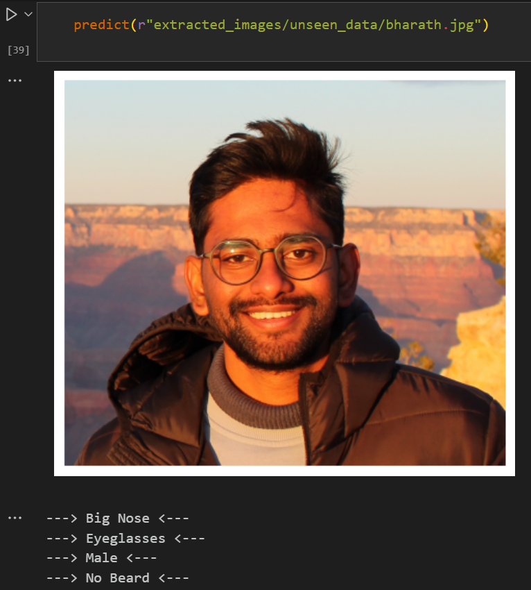
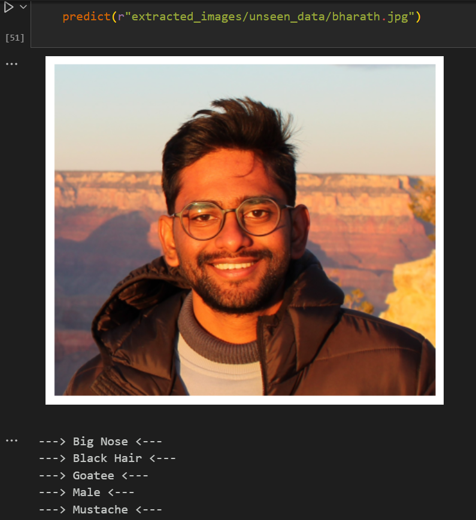
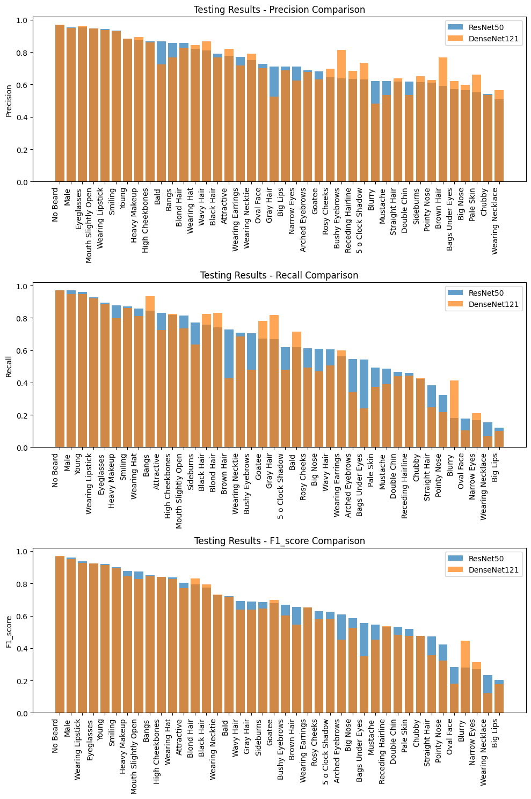

# Deep Learning Project: Face Attributes Prediction

    

This repository contains the implementation of a deep learning project for face attribute prediction using models like DenseNet121 and ResNet50. It includes notebooks, trained models, evaluation metrics, and outputs for comprehensive analysis.

## Table of Contents

1. [Introduction](#introduction)
2. [Project Structure](#project-structure)
3. [Model Details](#model-details)
4. [Evaluation](#evaluation)
5. [Datasets](#datasets)
6. [Visualizations](#visualizations)
7. [Dependencies](#dependencies)

## Introduction

The project focuses on predicting facial attributes using deep learning models. It utilizes popular architectures such as DenseNet121 and ResNet50, and includes pre-trained models fine-tuned on the CelebA dataset.

## Project Structure

- **`model_evaluation/`**: Contains evaluation notebooks and results.
- **`model_images/`**: Includes visual outputs generated during modeling and evaluation.
- **`models_trained/`**: Stores pre-trained and fine-tuned models.
- **`output_metrics/`**: Detailed metrics and performance outputs.
- **`testing_notebooks/`**: Notebooks for testing and debugging the models.
- **Notebooks**:
  - `MIS_548_DL_PROJECT_DenseNet121.ipynb`: Implementation of DenseNet121.
  - `MIS_548_DL_PROJECT_ResNet50.ipynb`: Implementation of ResNet50.
  - `MIS_548_Metrics.ipynb`: Evaluation metrics for the models.
- **Datasets**:
  - `list_attr_celeba.csv`: Attributes of CelebA dataset.
  - `list_bbox_celeba.csv`: Bounding boxes for face detection.
  - `list_eval_partition.csv`: Partitioning of the CelebA dataset.
  - `list_landmarks_align_celeba.csv`: Facial landmarks for alignment.

## Model Details

### DenseNet121
- A convolutional neural network that connects each layer to every other layer.
- Fine-tuned for facial attribute prediction.

### ResNet50
- A deep residual network that facilitates training deeper networks.
- Used for extracting features and predicting attributes.

## Evaluation

Model performance is evaluated using:
- **Accuracy**
- **Precision**
- **Recall**
- **F1 Score**

Results and metrics are stored in the `output_metrics/` directory and summarized in `MIS_548_Metrics.ipynb`.

## Datasets

The CelebA dataset is used for training and evaluation. It includes:
- Over 200,000 labeled images with 40 binary attributes.
- Metadata files for attributes, bounding boxes, and landmarks.

## Visualizations

    <b>ResNet50 Predictions on Unseen Data</b> 
    

    <b>DenseNet121 Predictions on Unseen Data</b> 
    

    <b>Model Testing Result Comparison</b> 
    

## Dependencies

The project uses:
- `TensorFlow`
- `Keras`
- `PyTorch`
- `scikit-learn`
- `matplotlib`
- `pandas`
- `numpy`

Ensure all dependencies are installed using `requirements.txt`.
